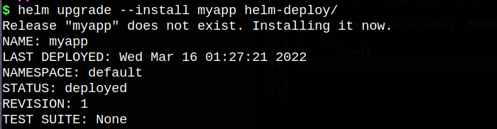
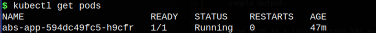
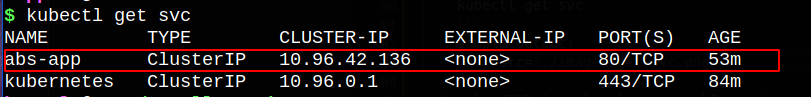
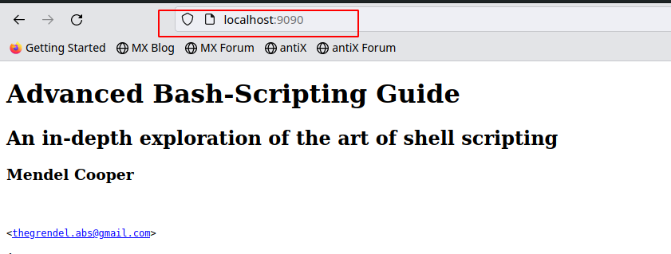

## Objective of the Task:

* Building container and kubernetes deployment solution for ABS-Guide application

## TechStack:
1. Docker
2. YAML
3. KIND (Kubernetes IN Docker)
4. Helm Charts
5. Kubectl

## Steps to Build and Deploy ABS App in K8s Environment
### Step 1: 
**Clonning Movella Task Repo**

* Clone this repo to build and deploy abs app
    ```SHELL
        git clone https://github.com/ShoebKhan2/movella-task.git
        cd movella-task
    ```
**Building Docker Image**

* Build docker image of using the below command
    ```SHELL
        docker build -t abs-app:v1 .
    ```

**(Optional) Pushing ABS Docker Image to Registry**
* You can deploy created abs-app docker image to your docker registry by using below commands
    ```SHELL
        docker login # login to your registry
        docker tag abs-app:v1 <repoName/userName>/abs-app:v1 # Add your Registry ID prefix to abs-app
        docker push <repoName/userName>/abs-app:v1
    ```

**Existing Image Details**
* I have already added abs-app docker image  into my DockerHub account: [abs-app dockerhub](https://hub.docker.com/repository/docker/shoeb151/abs-app)

### Step 2: Setting up Kubernetes Local Cluster
**Setting-Up KIND:**
* kind is a tool for running local Kubernetes clusters using Docker container “nodes”.
kind was primarily designed for testing Kubernetes itself, but may be used for local development or CI.
* Install KIND in your workstation using the official guide, [Kind-Install-Guide](https://kind.sigs.k8s.io/docs/user/quick-start/#installation)

**Linux Environment:**
* I am using linux environment, below are the ready to run commands to setup and work with KIND cluster
    ```SHELL
    #Installing KIND
    curl -Lo ./kind https://kind.sigs.k8s.io/dl/v0.11.1/kind-linux-amd64
    chmod +x ./kind
    sudo mv ./kind /usr/bin/kind
    #Creating cluster
    kind create cluster
    #Checking cluster
    docker ps                   # you will see "kind-control-plane" container will be running 
    #Accessing cluster using kubectl
    kubectl config get-contexts # you will be seeing kind cluster in the list
    ```

### Step 3: Deploying Abs-App into Kind K8s cluster
**prerequisites for deployment:**
- [docker](https://docs.docker.com/engine/install/)
- [kubectl](https://kubernetes.io/docs/tasks/tools/install-kubectl-linux/)
- [helm](https://helm.sh/docs/intro/install/)

**Deploying abs-app in 2 ways, as mentioned below:**

    1. Using Helm Charts
    2. Using Manifest Yamls


### Type-1 : Using Helm Charts

* Navigate to `helm-deploy` folder and install helm chart

    ```SHELL
    helm --upgrade install myapp helm-deploy/
    ```
    **sample output:**

    

### Type-2 : Using Manifest yamls
**Deploying**
* Navigate to `manifests-deploy` folder and apply the deployment and service yaml using kubectl

    ```SHELL
    cd manifest-deploy
    kubectl apply -f abs-deployment.yaml
    kubectl apply -f abs-service.yaml
    ```

### Step 4: Validating

**Checking pods:**
* use the below command to check the pods status
    ```SHELL
    kubectl get pods
    ```

    **sample output:**
    

**Checking Service:**
* use the below command to check the services
    ```SHELL
    kubectl get svc
    ```

    **sample output:**
    

**Port-Forward**
* As the kind is a local testing k8s environment, we can use port-forward to host application locally:
    ```SHELL
    kubectl port-forward $(kubectl get pod -l app=abs-app -o jsonpath="{.items[0].metadata.name}") 8080:80
    ```


**App Testing**
* Now appication is running on port `localhost:9090`, try to open `http://localhost:9090` in your local browser
    
    **sample output:**
    

